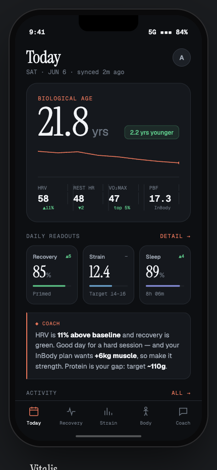
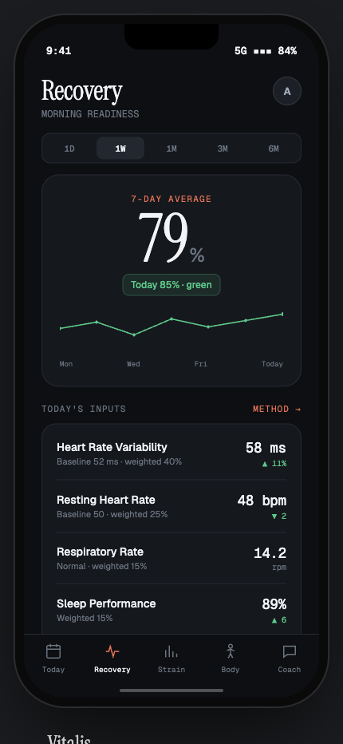
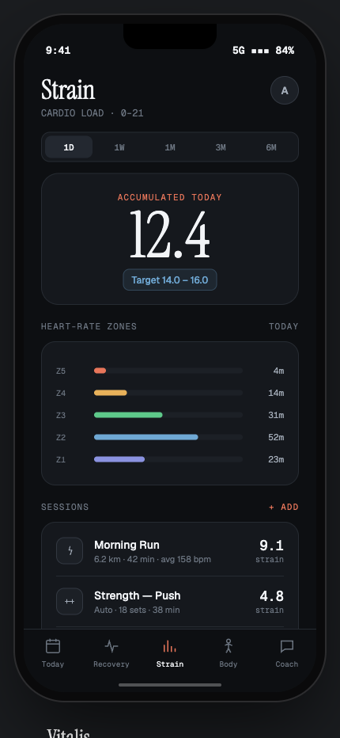
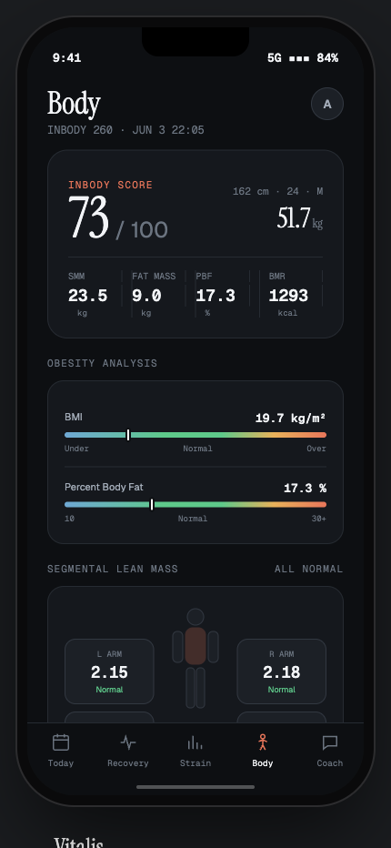
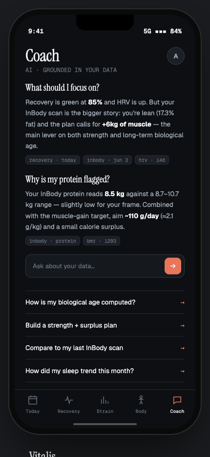

# Vitalis — iOS Health App

A native iOS app that turns **Apple Health** data (from a Helio/Whoop-style strap) plus
manual **InBody** body-composition scans into a single north-star metric: **Biological
Age**. It models Recovery, Strain and Sleep (a Whoop-style scoring approach) and adds body
composition that no wrist wearable can measure.

**100% on-device.** No backend, no accounts, no cloud. Every algorithm runs locally and
nothing leaves the phone.

## Screens

The five tabs — Today, Recovery, Strain, Body, Coach:

| Today | Recovery | Strain | Body | Coach |
|---|---|---|---|---|
|  |  |  |  |  |

> Rendered from the app's design prototype (`docs/VITALIS_SPEC.md` describes the same
> screens the SwiftUI build implements). Numbers shown are sample data.

## Stack

- **iOS 17+ · SwiftUI · HealthKit · Swift 5.9+**
- No third-party dependencies — pure Apple frameworks.

## How to run

1. Open the project in **Xcode 15 or newer**:
   ```bash
   open Vitalis.xcodeproj
   ```
2. Select the **Vitalis** scheme and set your own signing team
   (Signing & Capabilities → Team) — the bundle ID may need to be made unique.
3. **Run on a real iPhone (iOS 17+).** HealthKit returns no data in the Simulator for most
   metrics, so a physical device is needed to see real numbers. The app ships with demo
   data so the UI is populated even before Health access is granted.
4. On first launch, grant Health read access when prompted.

## Where the data comes from

The app never talks to a wearable directly:

```
Helio / Whoop strap → vendor app → Apple Health (HealthKit) → Vitalis (reads)
InBody printout → manual entry → local store
```

## Project layout

```
Vitalis/
  VitalisApp.swift          app entry point
  Core/
    Health/                 HealthKit reads, readings model, demo data
    InBody/                 InBody scan model + import
    Models/                 shared metric types
    Scoring/                Biological Age / Recovery / Strain scoring + norms
  DesignSystem/             theme, typography, reusable UI components
  Features/
    Today/ Recovery/ Strain/ Body/ Coach/ Onboarding/   the five tabs + auth
VitalisTests/               scoring + persistence unit tests
docs/VITALIS_SPEC.md        full product + build specification
```

## Tests

Open the project in Xcode and run **Product → Test** (⌘U). Unit tests cover the scoring
math and local persistence (`VitalisTests/`).

## Design reference

The complete product spec — pillars, scoring model, data-flow rules, and phase-by-phase
build plan — is in [`docs/VITALIS_SPEC.md`](docs/VITALIS_SPEC.md).
